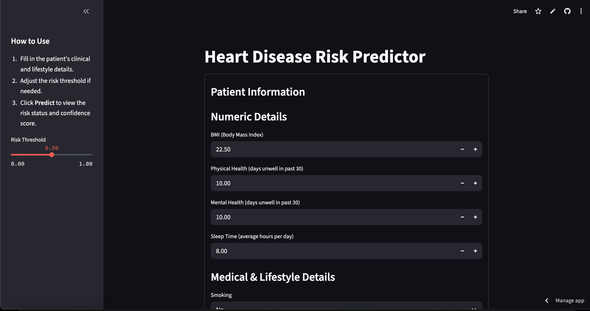
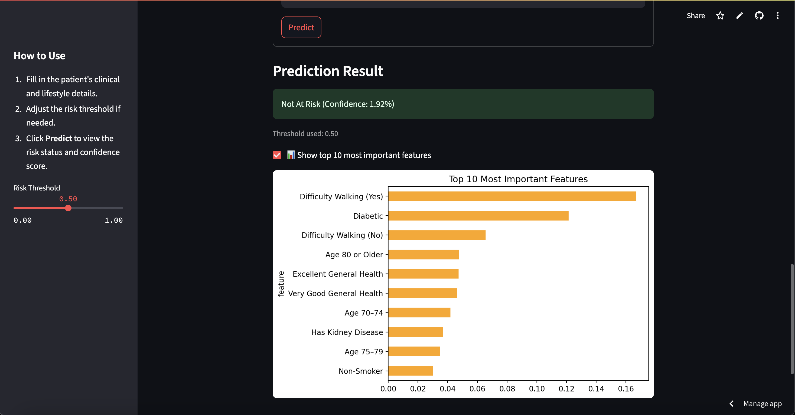

# ❤️ Heart Disease Risk Predictor

A simple, interactive machine learning web app that predicts a patient’s risk of developing **heart disease**. Designed for community health clinics, this tool helps medical staff input patient details and instantly see whether a patient is **"At Risk"** or **"Not At Risk"**, along with a confidence score.

Built with **Python**, **XGBoost**, **scikit-learn**, and **Streamlit**.

---

## 📊 Features

- Predicts heart disease risk using real patient metrics
- Interactive Streamlit UI with a risk threshold slider
- Displays confidence percentage and risk status
- Optionally shows the top 10 most important predictive features
- Model trained on the _Heart Disease 2020_ dataset

---

## 📷 Screenshot

🧠 How It Works

The model was trained using:
• 🧹 Preprocessing (imputation, encoding, scaling)
• 🎯 Target: HeartDisease (Yes → 1, No → 0)
• 🧠 Algorithm: XGBoostClassifier
• 📈 Evaluation: Cross-validation + test ROC AUC (~0.84)

⸻

🚀 Try the Live App

👉 Launch the Streamlit App

http://localhost:8501/

🛠 How to Run Locally

1. Clone the repo

git clone https://github.com/yourusername/heart-risk-predictor.git
cd heart-risk-predictor

2. Create a virtual environment and
   activate it

python -m venv venv
source venv/bin/activate # Mac/Linux
venv\Scripts\activate.bat # Windows

3. Install dependencies

pip install -r requirements.txt

4. Run the Streamlit app
   streamlit run app.py

🧪 Model Training Notebook

The full data preparation, training, evaluation, and export steps are in:

# heartdisease.ipynb

📁 Files in This Project

File - Description
app.py - Streamlit app
model_pipeline.pkl - Trained XGBoost model w/ preprocessing
feature_metadata.json - Input field definitions
requirements.txt - Python dependencies
notebook/ - Jupyter Notebook for model training

⚠️ Disclaimer

This tool is for preliminary screening only. It should not be used for medical decisions without a licensed physician.

👨‍💻 Author

Rafael Mercado
📅 July 2025
